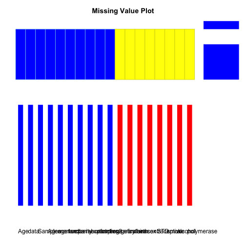

# Data quality report for HPV Open Data Collection Project

Velber Xavier, PhD velberxavier@gmail.com
Jose Eduardo Santana, MSc candidate jes@ic.ufal.br
Jacson Barros, MSc Jacsonv@ffm.br
Amrapali Zaver, MSc, PhD candidate zaveri@informatik.uni-leipzig.de
Ricardo Pietrobon, MD, PhD rpietro@duke.edu

<!---
Velber and Jose Eduardo, do you guys have institutional email addresses? if so, please add them above
-->


<!---
Velber, please take the previous line where it says label and then create labels for each one of the variables you have in your data set. please write them in simple Portuguese and then convert them to English using Google translate. please talk with Jose Eduardo if you have any questions
-->

## Introduction
The main objective of this report is to provide a 24/7 snapshop at the data quality behind the HPV Open Data Collection Project. This includes not only the original data set collected under Dr. Xavier in Maceio, Brazil, but also any additional data sets brought in from other registries, prospective studies, as well as Linked Open Data sources.

Methodological details about the study can be found at [HPV Open Data Collection Project](site)

Below is a full list of variables along with their class (variable type according to the R language) and alternative responses. Most of the variable names should be intuitive, but a full dictionary is also described below:


```
## hpv 
## 
##  35  Variables      998  Observations
## ---------------------------------------------------------------------------
## IDENTIFICAÇÃO 
##       n missing  unique 
##     998       0     998 
## 
## lowest : CSHF1    CSHF10   CSHF100  CSHF1000 CSHF101 
## highest: CSHF995  CSHF996  CSHF997  CSHF998  CSHF999  
## ---------------------------------------------------------------------------
## IDADE : age at the time of the first consultation 
##       n missing  unique    Mean     .05     .10     .25     .50     .75 
##      52     946      34   36.25    16.0    18.1    23.0    36.5    46.0 
##     .90     .95 
##    55.0    60.9 
## 
## lowest : 13 15 16 17 18, highest: 55 56 60 62 70 
## ---------------------------------------------------------------------------
## PROFISSÃO 
##       n missing  unique 
##     998       0      13 
## 
##  (949, 95%), Atendente (1, 0%), Autônoma (2, 0%), Auxiliar (1, 0%) 
## Comerciária (1, 0%), Doméstica (30, 3%), Estudante (5, 1%) 
## Funcionária Pública (1, 0%), Garçonete (1, 0%) 
## Profissional do Sexo (1, 0%), Servidora Pública (1, 0%) 
## Serviços Gerais (1, 0%), Vendedora (4, 0%) 
## ---------------------------------------------------------------------------
## NATURALIDADE 
##       n missing  unique 
##     998       0      20 
## 
## lowest :                            Aracaju - SE               Belém - AL                 Capela - AL                Flexeiras - AL            
## highest: São Miguel dos Campos - AL São Paulo - SP             Traipu - AL                União dos Palmares - AL    Viçosa - AL                
## ---------------------------------------------------------------------------
## MENARCA : age at the time of the first period 
##       n missing  unique    Mean 
##      57     941       8   12.75 
## 
##           7 9 11 12 13 14 15 16
## Frequency 1 1 10 15 10 12  5  3
## %         2 2 18 26 18 21  9  5
## ---------------------------------------------------------------------------
## I.A.S. 
##       n missing  unique    Mean     .05     .10     .25     .50     .75 
##      57     941      13   17.39    12.8    14.0    15.0    17.0    18.0 
##     .90     .95 
##    21.8    24.2 
## 
##           12 13 14 15 16 17 18 21 23 24 25 27 32
## Frequency  3  1  4  9  5 15 11  3  1  2  1  1  1
## %          5  2  7 16  9 26 19  5  2  4  2  2  2
## ---------------------------------------------------------------------------
## Nº.PARCEIROS 
##       n missing  unique    Mean 
##      57     941       9   3.702 
## 
##            1  2  3  4  5 6 7 20 40
## Frequency 17  9 14  6  6 1 2  1  1
## %         30 16 25 11 11 2 4  2  2
## ---------------------------------------------------------------------------
## Nº.FILHOS 
##       n missing  unique    Mean     .05     .10     .25     .50     .75 
##      57     941      10   2.246     0.0     0.0     1.0     1.0     3.0 
##     .90     .95 
##     4.4     6.2 
## 
##            0  1  2 3  4 5 6 7 11 12
## Frequency  9 20 11 5  6 1 2 1  1  1
## %         16 35 19 9 11 2 4 2  2  2
## ---------------------------------------------------------------------------
## Nº.ABORTOS 
##       n missing  unique 
##     998       0       5 
## 
##                0 1 2 o
## Frequency 941 53 1 2 1
## %          94  5 0 0 0
## ---------------------------------------------------------------------------
## GESTANTE.NO.MOMENTO 
##       n missing  unique 
##     998       0       3 
## 
##  (941, 94%), NÃO (46, 5%), SIM (11, 1%) 
## ---------------------------------------------------------------------------
## MESES.DE.GESTAÇÃO 
##       n missing  unique    Mean 
##      11     987       5   3.909 
## 
##            2  3  4  5  6
## Frequency  2  3  2  2  2
## %         18 27 18 18 18
## ---------------------------------------------------------------------------
## IDADE.DA.1ª.GESTAÇÃO 
##       n missing  unique    Mean     .05     .10     .25     .50     .75 
##      57     941      18   18.26     0.0     7.8    16.0    19.0    21.0 
##     .90     .95 
##    28.0    30.4 
## 
##            0 13 14 15 16 17 18 19 20 21 22 23 24 28 29 30 32 37
## Frequency  6  1  1  3  6  4  5  9  5  3  2  3  1  3  1  1  2  1
## %         11  2  2  5 11  7  9 16  9  5  4  5  2  5  2  2  4  2
## ---------------------------------------------------------------------------
## SEXO.ORAL 
##       n missing  unique 
##     998       0       3 
## 
##  (941, 94%), NÃO (42, 4%), SIM (15, 2%) 
## ---------------------------------------------------------------------------
## SEXO.ANAL 
##       n missing  unique 
##     998       0       3 
## 
##  (941, 94%), NÃO (47, 5%), SIM (10, 1%) 
## ---------------------------------------------------------------------------
## ANTICONCEPTIVOS 
##       n missing  unique 
##     998       0       3 
## 
##  (941, 94%), NÃO (55, 6%), SIM (2, 0%) 
## ---------------------------------------------------------------------------
## TEMPO 
##       n missing  unique 
##     998       0       3 
## 
##  (996, 100%), 1 ANO (1, 0%), 4 MESES (1, 0%) 
## ---------------------------------------------------------------------------
## DOSAGEM 
##       n missing  unique 
##     998       0       2 
## 
##  (996, 100%), IGNORADO (2, 0%) 
## ---------------------------------------------------------------------------
## DST 
##       n missing  unique 
##     998       0       4 
## 
##  (941, 94%), IGNORADO (3, 0%), NÃO (51, 5%), SIM (3, 0%) 
## ---------------------------------------------------------------------------
## QUAIS 
##       n missing  unique 
##     998       0       3 
## 
##  (995, 100%), HPV (2, 0%), TRICHOMONAS VAGINALIS (1, 0%) 
## ---------------------------------------------------------------------------
## TRATAMENTO 
##       n missing  unique 
##     998       0       2 
## 
##  (995, 100%), SIM (3, 0%) 
## ---------------------------------------------------------------------------
## TABAGISMO 
##       n missing  unique 
##     998       0       3 
## 
##  (941, 94%), NÃO (51, 5%), SIM (6, 1%) 
## ---------------------------------------------------------------------------
## TEMPO.1 
##       n missing  unique 
##     998       0       7 
## 
##               12 ANOS 20 ANOS 30 ANOS 50 ANOS 6 ANOS 8 ANOS
## Frequency 992       1       1       1       1      1      1
## %          99       0       0       0       0      0      0
## ---------------------------------------------------------------------------
## QUANTIDADE 
##       n missing  unique 
##     998       0       4 
## 
##  (992, 99%), 20 CIGARROS/DIA (3, 0%), 30 CIGAROS/DIA (1, 0%) 
## 40 CIGARROS/DIA (2, 0%) 
## ---------------------------------------------------------------------------
## ETILISTA 
##       n missing  unique 
##     998       0       3 
## 
##  (941, 94%), NÃO (51, 5%), SIM (6, 1%) 
## ---------------------------------------------------------------------------
## TEMPO.2 
##       n missing  unique 
##     998       0       7 
## 
##               1 ANO 20 ANOS 4 ANOS 5 ANOS 6 ANOS 8 ANOS
## Frequency 992     1       1      1      1      1      1
## %          99     0       0      0      0      0      0
## ---------------------------------------------------------------------------
## CITOLOGIA.ONCÓTICA 
##       n missing  unique 
##     998       0       2 
## 
##  (974, 98%), SIM (24, 2%) 
## ---------------------------------------------------------------------------
## RESULTADO 
##       n missing  unique 
##     998       0       4 
## 
##  (974, 98%), NEGATIVO PARA LESÕES/HPV (22, 2%), NIC I (1, 0%) 
## NIC II e NIC III (1, 0%) 
## ---------------------------------------------------------------------------
## COLPOSCOPIA 
##       n missing  unique 
##     998       0       3 
## 
##  (976, 98%), NÃO (21, 2%), SIM (1, 0%) 
## ---------------------------------------------------------------------------
## RESULTADO.1 
##       n missing  unique 
##     998       0       2 
## 
##  (997, 100%), NORMAL (1, 0%) 
## ---------------------------------------------------------------------------
## HISTOPATOLOGIA 
##       n missing  unique 
##     998       0       2 
## 
##  (976, 98%), NÃO (22, 2%) 
## ---------------------------------------------------------------------------
## RESULTADO.2 
##       n missing  unique 
##       0     998       0 
## ---------------------------------------------------------------------------
## PCR.HPV 
##       n missing  unique 
##     998       0       2 
## 
##  (941, 94%), SIM (57, 6%) 
## ---------------------------------------------------------------------------
## RESULTADO.PCR.HPV 
##       n missing  unique 
##     998       0       3 
## 
##  (941, 94%), NEGATIVO (52, 5%), POSITIVO (5, 1%) 
## ---------------------------------------------------------------------------
## TIPO.HPV 
##       n missing  unique 
##       0     998       0 
## ---------------------------------------------------------------------------
## OBSERVAÇÕES 
##       n missing  unique 
##     998       0       2 
## 
##  (995, 100%), A paciente fez Histerectomia (3, 0%) 
## ---------------------------------------------------------------------------
```


A description of missing values is provided in the Figure below, where missing values are presented in yellow.

```r
library(vmv)
tablemissing(hpv)
```

 

```
##       IDENTIFICAÇÃO IDADE PROFISSÃO NATURALIDADE MENARCA I.A.S.
## 1                 1     1         1            1       1      1
## 2                 1     1         1            1       1      1
## 3                 1     0         1            1       1      1
## 4                 1     0         1            1       0      0
## Total             0   946         0            0     941    941
##       Nº.PARCEIROS Nº.FILHOS Nº.ABORTOS GESTANTE.NO.MOMENTO
## 1                1         1          1                   1
## 2                1         1          1                   1
## 3                1         1          1                   1
## 4                0         0          1                   1
## Total          941       941          0                   0
##       MESES.DE.GESTAÇÃO IDADE.DA.1ª.GESTAÇÃO SEXO.ORAL SEXO.ANAL
## 1                     1                    1         1         1
## 2                     0                    1         1         1
## 3                     0                    1         1         1
## 4                     0                    0         1         1
## Total               987                  941         0         0
##       ANTICONCEPTIVOS TEMPO DOSAGEM DST QUAIS TRATAMENTO TABAGISMO TEMPO.1
## 1                   1     1       1   1     1          1         1       1
## 2                   1     1       1   1     1          1         1       1
## 3                   1     1       1   1     1          1         1       1
## 4                   1     1       1   1     1          1         1       1
## Total               0     0       0   0     0          0         0       0
##       QUANTIDADE ETILISTA TEMPO.2 CITOLOGIA.ONCÓTICA RESULTADO COLPOSCOPIA
## 1              1        1       1                  1         1           1
## 2              1        1       1                  1         1           1
## 3              1        1       1                  1         1           1
## 4              1        1       1                  1         1           1
## Total          0        0       0                  0         0           0
##       RESULTADO.1 HISTOPATOLOGIA RESULTADO.2 PCR.HPV RESULTADO.PCR.HPV
## 1               1              1           0       1                 1
## 2               1              1           0       1                 1
## 3               1              1           0       1                 1
## 4               1              1           0       1                 1
## Total           0              0         998       0                 0
##       TIPO.HPV OBSERVAÇÕES Total
## 1            0           1    11
## 2            0           1    41
## 3            0           1     5
## 4            0           1   941
## Total      998           0   998
```

Below is an application of the MINE (maximal Information-based Nonparametric Exploration) algorithm from the Science article (Detecting Novel Association in Large Data Sets)[http://www.sciencemag.org/content/334/6062/1518.abstract?ijkey=cRCIlh2G7AjiA&keytype=ref&siteid=sci]. See also (http://www.exploredata.net/)[http://www.exploredata.net/]


```r
source("http://www.exploredata.net/ftp/MINE.r")
MINE("/Users/rpietro/Google Drive/R/nonpublicdata_publications/HPV/hpv.csv", 
    "all.pairs")
```

```
## Error: class not found
```

