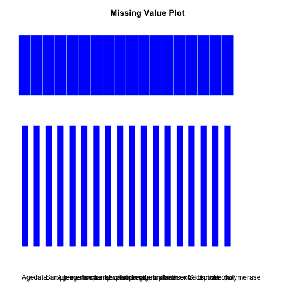

# Data quality and exploratory graphical analysis report for HPV Open Data Collection Project

Velber Xavier, PhD velberxavier@gmail.com
Jose Eduardo Santana, MSc candidate jes@ic.ufal.br
Jacson Barros, MSc Jacsonv@ffm.br
Joao Ricardo Vissoci, PhD candidate jnv4@duke.edu
Amrapali Zaveri, MSc, PhD candidate zaveri@informatik.uni-leipzig.de
Ricardo Pietrobon, MD, PhD rpietro@duke.edu

<!---
Velber and Jose Eduardo, do you guys have institutional email addresses? if so, please add them above
-->


```
## Error: file 'Hmisc' is not an OS X binary package
```

```
## Error: package 'e1071' could not be loaded
```


<!---
Velber, please take the previous line where it says label and then create labels for each one of the variables you have in your data set. please write them in simple Portuguese and then convert them to English using Google translate. please talk with Jose Eduardo if you have any questions
-->

## Introduction
The main objective of this report is to provide a 24/7 snapshop at the data quality behind the HPV Open Data Collection Project. This includes not only the original data set collected under Dr. Xavier in Maceio, Brazil, but also any additional data sets brought in from other registries, prospective studies, as well as Linked Open Data sources.

Methodological details about the study can be found at [HPV Open Data Collection Project](site)

## Data Description
Below is a full list of variables along with their class (variable type according to the R language) and alternative responses. Most of the variable names should be intuitive, but a full dictionary is also described below:


```
##                   var  n  mean    sd median trimmed   mad min max range
## Age                 1 57 35.61 14.56     35   34.79 16.31  13  70    57
## data*               2 57  5.42  2.20      5    5.43  1.48   1   9     8
## Samples             3 57  6.21  3.33      6    6.21  4.45   1  12    11
## Agemenarche         4 57 12.75  1.70     13   12.77  1.48   7  16     9
## age1sex             5 57 17.39  3.64     17   16.94  1.48  12  32    20
## numbersexpartners   6 57  3.70  5.63      3    2.68  1.48   1  40    39
## parity              7 57  2.25  2.42      1    1.83  1.48   0  12    12
## abortion1           8 57  0.09  0.39      0    0.00  0.00   0   2     2
## abortion2           9 57  0.00  0.00      0    0.00  0.00   0   0     0
## pregnancy*         10 57  1.19  0.40      1    1.13  0.00   1   2     1
## agefirstbirth      11 57 18.26  7.97     19   18.74  4.45   0  37    37
## oralsex*           12 57  1.26  0.44      1    1.21  0.00   1   2     1
## anasex*            13 57  1.18  0.38      1    1.11  0.00   1   2     1
## contraceptive*     14 57  1.04  0.19      1    1.00  0.00   1   2     1
## STD*               15 57  2.00  0.33      2    2.00  0.00   1   3     2
## smoke*             16 57  1.11  0.31      1    1.02  0.00   1   2     1
## alcohol*           17 57  1.11  0.31      1    1.02  0.00   1   2     1
## polymerase*        18 57  1.09  0.29      1    1.00  0.00   1   2     1
##                    skew kurtosis   se
## Age                0.40    -0.70 1.93
## data*              0.32    -0.75 0.29
## Samples            0.02    -1.25 0.44
## Agemenarche       -0.43     0.92 0.23
## age1sex            1.64     3.66 0.48
## numbersexpartners  5.09    28.46 0.75
## parity             2.13     5.27 0.32
## abortion1          4.32    17.60 0.05
## abortion2           NaN      NaN 0.00
## pregnancy*         1.52     0.30 0.05
## agefirstbirth     -0.65     1.04 1.06
## oralsex*           1.05    -0.92 0.06
## anasex*            1.66     0.78 0.05
## contraceptive*     4.92    22.61 0.02
## STD*               0.00     6.17 0.04
## smoke*             2.51     4.35 0.04
## alcohol*           2.51     4.35 0.04
## polymerase*        2.84     6.17 0.04
```


A description of missing values is provided in the Figure below, where missing values are presented in yellow.
 

```
##       Age data Samples Agemenarche age1sex numbersexpartners parity
## 1       1    1       1           1       1                 1      1
## Total   0    0       0           0       0                 0      0
##       abortion1 abortion2 pregnancy agefirstbirth oralsex anasex
## 1             1         1         1             1       1      1
## Total         0         0         0             0       0      0
##       contraceptive STD smoke alcohol polymerase Total
## 1                 1   1     1       1          1    57
## Total             0   0     0       0          0    57
```


## Data Quality

Below is a series of graph representations regarding data quality control. Firste set o graphs show the ... gaphs. These graphs aim to indicate ... . These graphs were created with the qcc package (link) from R Language Open Software.

 


bla bla bla

 


bla bla bla

 


bla bla bla

 


bla bla bla


 


bla bla bla

 


bla bla bla

 


## Data Association

Figures regarding associations between variables from the HPV Open Design Data collection projetc are presente below. First set of figures show the the comparison of ... (put numeric variables) between subjects with postivie and negative polymerase values (Checar com Velber).

 


Below is an application of the MINE (maximal Information-based Nonparametric Exploration) algorithm from the Science article (Detecting Novel Association in Large Data Sets)[http://www.sciencemag.org/content/334/6062/1518.abstract?ijkey=cRCIlh2G7AjiA&keytype=ref&siteid=sci]. See also (http://www.exploredata.net/)[http://www.exploredata.net/]. This application was used to explore the associations between variables inside the dataset. Variables with highe values of linear relation (MIC-definition)  as well as the analysis of non-lnear associations (MAS - Definition) are shown in figures below.

## Problem with MINE, need to add the data set to the working directory. 
## Any ideia how we can bring the results from mine into the .rmd file as a table?

```
## Error: java.io.FileNotFoundException: hpv.csv (No such file or directory)
```


  

