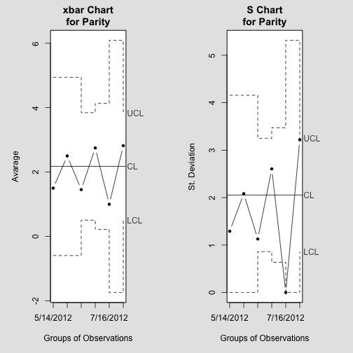
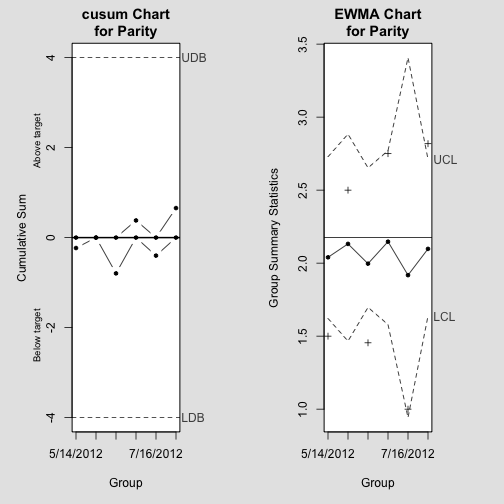

# Data quality and exploratory graphical analysis report for HPV Open Data Collection Project

Velber Xavier, PhD velberxavier@gmail.com
Jose Eduardo Santana, MSc candidate jes@ic.ufal.br
Jacson Barros, MSc Jacsonv@ffm.br
Joao Ricardo Nickenig Vissoci, PhD candidate jnv4@duke.edu
Amrapali Zaveri, MSc, PhD candidate zaveri@informatik.uni-leipzig.de
Ricardo Pietrobon, MD, PhD rpietro@duke.edu


## Introduction
The main objective of this report is to provide a 24/7 snapshop at the data quality behind the HPV Open Data Collection Project. This includes not only the original data set collected under Dr. Xavier in Maceio, Brazil, but also any additional data sets brought in from other registries, prospective studies, as well as Linked Open Data sources.

Methodological details about the study can be found at [HPV Open Data Collection Project](site)

## Data Description
Below is a full list of variables along with their class (variable type according to the R language) and alternative responses. Most of the variable names should be intuitive, but a full dictionary is also described below:


```
## hpv 
## 
##  18  Variables      57  Observations
## ---------------------------------------------------------------------------
## Age 
##       n missing  unique    Mean     .05     .10     .25     .50     .75 
##      57       0      36   35.61    16.0    17.6    23.0    35.0    45.0 
##     .90     .95 
##    55.0    60.4 
## 
## lowest : 13 15 16 17 18, highest: 55 56 60 62 70 
## ---------------------------------------------------------------------------
## data 
##       n missing  unique 
##      57       0       9 
## 
##           4/30/2012 5/14/2012 5/21/2012 6/11/2012 6/4/2012 7/11/2012
## Frequency         1         4         4        11       15         8
## %                 2         7         7        19       26        14
##           7/16/2012 7/18/2012 7/2/2012
## Frequency         2         1       11
## %                 4         2       19
## ---------------------------------------------------------------------------
## Samples 
##       n missing  unique    Mean     .05     .10     .25     .50     .75 
##      57       0      12   6.211       1       2       3       6       9 
##     .90     .95 
##      11      11 
## 
##           1 2 3 4 5 6 7 8 9 10 11 12
## Frequency 5 5 5 5 5 5 5 5 5  5  5  2
## %         9 9 9 9 9 9 9 9 9  9  9  4
## ---------------------------------------------------------------------------
## Agemenarche 
##       n missing  unique    Mean 
##      57       0       8   12.75 
## 
##           7 9 11 12 13 14 15 16
## Frequency 1 1 10 15 10 12  5  3
## %         2 2 18 26 18 21  9  5
## ---------------------------------------------------------------------------
## age1sex 
##       n missing  unique    Mean     .05     .10     .25     .50     .75 
##      57       0      13   17.39    12.8    14.0    15.0    17.0    18.0 
##     .90     .95 
##    21.8    24.2 
## 
##           12 13 14 15 16 17 18 21 23 24 25 27 32
## Frequency  3  1  4  9  5 15 11  3  1  2  1  1  1
## %          5  2  7 16  9 26 19  5  2  4  2  2  2
## ---------------------------------------------------------------------------
## numbersexpartners 
##       n missing  unique    Mean 
##      57       0       9   3.702 
## 
##            1  2  3  4  5 6 7 20 40
## Frequency 17  9 14  6  6 1 2  1  1
## %         30 16 25 11 11 2 4  2  2
## ---------------------------------------------------------------------------
## parity 
##       n missing  unique    Mean     .05     .10     .25     .50     .75 
##      57       0      10   2.246     0.0     0.0     1.0     1.0     3.0 
##     .90     .95 
##     4.4     6.2 
## 
##            0  1  2 3  4 5 6 7 11 12
## Frequency  9 20 11 5  6 1 2 1  1  1
## %         16 35 19 9 11 2 4 2  2  2
## ---------------------------------------------------------------------------
## abortion1 
##       n missing  unique    Mean 
##      57       0       3 0.08772 
## 
## 0 (54, 95%), 1 (1, 2%), 2 (2, 4%) 
## ---------------------------------------------------------------------------
## abortion2 
##       n missing  unique    Mean 
##      57       0       1       0 
## ---------------------------------------------------------------------------
## pregnancy 
##       n missing  unique 
##      57       0       2 
## 
## N’ÛO (46, 81%), SIM (11, 19%) 
## ---------------------------------------------------------------------------
## agefirstbirth 
##       n missing  unique    Mean     .05     .10     .25     .50     .75 
##      57       0      18   18.26     0.0     7.8    16.0    19.0    21.0 
##     .90     .95 
##    28.0    30.4 
## 
##            0 13 14 15 16 17 18 19 20 21 22 23 24 28 29 30 32 37
## Frequency  6  1  1  3  6  4  5  9  5  3  2  3  1  3  1  1  2  1
## %         11  2  2  5 11  7  9 16  9  5  4  5  2  5  2  2  4  2
## ---------------------------------------------------------------------------
## oralsex 
##       n missing  unique 
##      57       0       2 
## 
## N’ÛO (42, 74%), SIM (15, 26%) 
## ---------------------------------------------------------------------------
## anasex 
##       n missing  unique 
##      57       0       2 
## 
## N’ÛO (47, 82%), SIM (10, 18%) 
## ---------------------------------------------------------------------------
## contraceptive 
##       n missing  unique 
##      57       0       2 
## 
## N’ÛO (55, 96%), SIM (2, 4%) 
## ---------------------------------------------------------------------------
## STD 
##       n missing  unique 
##      57       0       3 
## 
## IGNORADO (3, 5%), N’ÛO (51, 89%), SIM (3, 5%) 
## ---------------------------------------------------------------------------
## smoke 
##       n missing  unique 
##      57       0       2 
## 
## N’ÛO (51, 89%), SIM (6, 11%) 
## ---------------------------------------------------------------------------
## alcohol 
##       n missing  unique 
##      57       0       2 
## 
## N’ÛO (51, 89%), SIM (6, 11%) 
## ---------------------------------------------------------------------------
## polymerase 
##       n missing  unique 
##      57       0       2 
## 
## NEGATIVO (52, 91%), POSITIVO (5, 9%) 
## ---------------------------------------------------------------------------
```


A description of missing values is provided in the Figure below, where missing values are presented in yellow.

 

```
##       Age data Samples Agemenarche age1sex numbersexpartners parity
## 1       1    1       1           1       1                 1      1
## Total   0    0       0           0       0                 0      0
##       abortion1 abortion2 pregnancy agefirstbirth oralsex anasex
## 1             1         1         1             1       1      1
## Total         0         0         0             0       0      0
##       contraceptive STD smoke alcohol polymerase Total
## 1                 1   1     1       1          1    57
## Total             0   0     0       0          0    57
```


## Data Quality

Below is a series of graph representations regarding data quality control. Firste set o graphs allow to evaluate trends, cycles, and shifts as data quality indicator. These graphs were created with the qcc package (http://cran.r-project.org/web/packages/qcc/index.html) from R Language Open Software.

 


 


Another example using a different continuous variable (Parity).

 


 


Also, OC Curves allow to evaluete power of the data quality control process. However, since we are working to control data quality for dataset withs different temporal sample sizes, OC plots were not abe to be created.


For categorical variables (e.g. positive polymerase test or pregnancy), we used data quality control charts for proportions over a group of subjects.

 


## Data Association

Figures regarding associations between variables from the HPV Open Design Data collection projetc are presente below. First set of figures show the the comparison of numeric variables from our dataset between subjects with postivie and negative polymerase values.


 


Below is an application of the MINE (maximal Information-based Nonparametric Exploration) algorithm from the Science article (Detecting Novel Association in Large Data Sets)[http://www.sciencemag.org/content/334/6062/1518.abstract?ijkey=cRCIlh2G7AjiA&keytype=ref&siteid=sci]. See also (http://www.exploredata.net/)[http://www.exploredata.net/]. This application was used to explore the associations between variables inside the dataset. Variables with highe values of linear relation (MIC-definition)  as well as the analysis of non-lnear associations (MAS - Definition) are shown in figures below.


```
## Error: java.io.FileNotFoundException: hpv.csv (No such file or directory)
```


```
##               X.var   Y.var MIC..strength. MIC.p.2..nonlinearity.
## 1            parity     Age         0.5537                 0.2507
## 2     agefirstbirth  parity         0.4293                 0.4119
## 3     agefirstbirth age1sex         0.3932                 0.2541
## 4     agefirstbirth     Age         0.3391                 0.2593
## 5           age1sex     Age         0.2751                 0.1112
## 6 numbersexpartners age1sex         0.2410                 0.1851
##   MAS..non.monotonicity. Linear.regression..p.
## 1                0.12691                0.5505
## 2                0.18272                0.1317
## 3                0.07957                0.3729
## 4                0.09785                0.2824
## 5                0.04975                0.4049
## 6                0.08022               -0.2364
```


After analyzing MINE results, we took the higher MIC and non-linear relations indicatores to plot in scatter plots.

      

